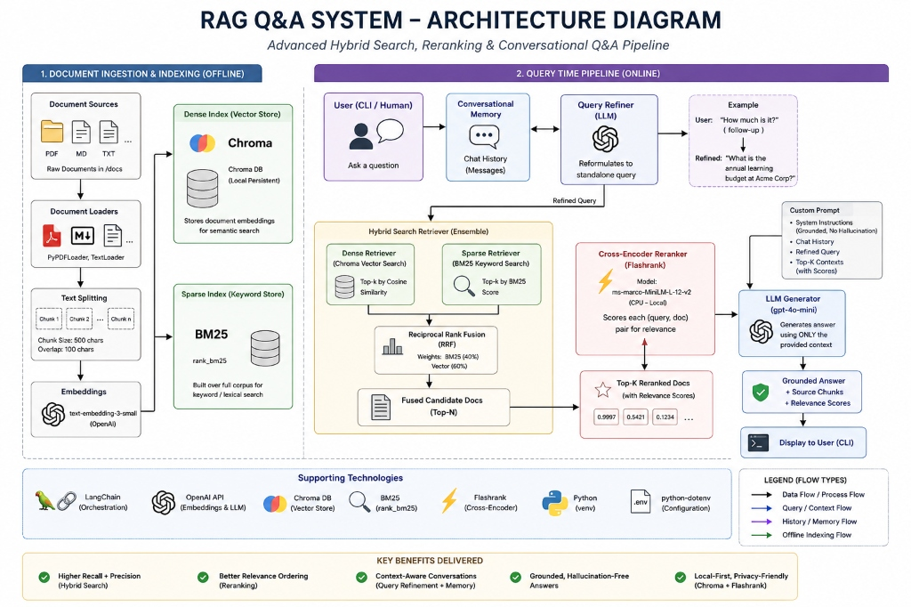

# 📊 RAG Q&A System: Advanced Hybrid Search & Reranking System

RAG Q&A System is a production-grade, local-first **Retrieval-Augmented Generation (RAG)** application. It implements state-of-the-art information retrieval techniques—combining sparse keyword indexing with dense vector search—fusing results using Reciprocal Rank Fusion, and filtering candidates via a local cross-encoder model to enable high-precision question-answering with conversational memory.

---

## 🚀 Key Features

### 🔍 Conversational Memory & Query Refinement
*   **Context-Aware Dialogues:** Maintains human-LLM message history using structured LangChain schemas.
*   **Autonomous Query Rephrasing:** Employs an LLM-driven query refiner to convert ambiguous or contextual follow-up questions (e.g., *"How much is it?"*) into descriptive standalone search queries (e.g., *"What is the annual learning budget at Acme Corp?"*) before initiating search.

### 🌐 Hybrid Search Retriever (Dense & Sparse)
*   **Dense Semantic Search:** Uses OpenAI's `text-embedding-3-small` model to embed document chunks, storing and searching them inside a local, persistent `Chroma` database.
*   **Sparse Keyword Search:** Employs a `BM25Retriever` fit dynamically over the database document corpus, enabling precise keyword searches for exact terminology, product codes, or acronyms.
*   **Reciprocal Rank Fusion (RRF):** Combines the sparse and dense candidate pools via a LangChain `EnsembleRetriever`, assigning unified rank weights (40% BM25, 60% Vector Search).

### ⚡ Local Cross-Encoder Reranking
*   **Lightweight CPU Reranker:** Integrates a local `Flashrank` compressor loading the `ms-marco-MiniLM-L-12-v2` cross-encoder model (~75MB) to run high-speed local inference.
*   **Noise Filtering:** Computes absolute query-document relevance scores, discarding low-scoring candidates and selecting only the top-matching context segments.
*   **Score Auditing:** Outputs real-time `Relevance Scores` in the log interface so developers and users can inspect retrieval confidence levels.

### 🛡️ Grounded & Hallucination-Free Generation
*   **Context Constraints:** The prompt system explicitly bounds the LLM generator (`gpt-4o-mini`) to answer *only* using the provided source context.
*   **Anti-Hallucination Fallback:** Instructs the LLM to output *"I don't know"* if the answer cannot be factually derived from the retrieved documents.

---

## 🏗️ Architecture & Component Flow



The pipeline follows a modular document ingestion, indexing, and retrieval lifecycle:

```
  DOCUMENTS (PDF/MD/TXT) ──► INGESTION ──► SPLITTER ──► CHROMA DB (Dense) & BM25 (Sparse)
                                                                 ▲
  CLIENT (Interactive Loop) ◄───► QUERY REPHRASER ◄──────────────┴───► LLM GENERATION
```

1.  **Ingestion ([ingest.py](file:///c:/Users/HP/RAG%20Q&A%20System/ingest.py)):** Scans a directory, parses files, splits texts into chunks of 500 characters (with 100 character overlap), generates vector embeddings, and saves them to a local Chroma vector index.
2.  **Query Session ([query.py](file:///c:/Users/HP/RAG%20Q&A%20System/query.py)):** Initializes the conversational loop, instantiates the hybrid retriever and cross-encoder, and runs the Q&A workflow.

### Request Lifecycle Sequence

```mermaid
sequenceDiagram
    autonumber
    actor User as Human User
    participant Loop as Interactive CLI (query.py)
    participant Refiner as Query Refiner (LLM)
    participant Ensemble as Ensemble Retriever (BM25 + Chroma)
    participant Reranker as Flashrank Reranker
    participant DB as Chroma Database
    participant Generator as LLM Generator (gpt-4o-mini)

    User->>Loop: Input question (e.g., "What can it be spent on?")
    Note over Loop: Check for existing conversation history
    Loop->>Refiner: Send question + Chat History
    Refiner->>Refiner: Reformulate question using conversational history
    Refiner-->>Loop: Return refined standalone query ("What types of expenses can the training budget be used for?")

    Loop->>Ensemble: Invoke search (refined query)
    Ensemble->>DB: Fetch dense vector candidates (Cosine similarity)
    DB-->>Ensemble: Return top-k dense documents
    Ensemble->>Ensemble: Run BM25 sparse keyword search on local corpus
    Ensemble->>Ensemble: Apply Reciprocal Rank Fusion (RRF)
    Ensemble-->>Loop: Return fused candidate document list

    Loop->>Reranker: Send query + fused documents
    Reranker->>Reranker: Calculate cross-encoder relevance scores
    Reranker-->>Loop: Return top-k reranked documents with scores

    Loop->>Generator: Send custom prompt (contexts + refined query + chat history)
    Note over Generator: Validate answer availability in context
    Generator-->>Loop: Return grounded answer response
    Loop-->>User: Display answer text & source details with Relevance Scores
```

---

## 🛠️ Technology Stack

*   **RAG Orchestration:** LangChain (Core, Community, Classic)
*   **Vector Database:** Chroma DB (local persistent vector store)
*   **Embedding Model:** OpenAI `text-embedding-3-small`
*   **Generation Model:** OpenAI `gpt-4o-mini`
*   **Sparse Retrieval Engine:** BM25 (`rank_bm25`)
*   **Reranking Engine:** Flashrank (`ms-marco-MiniLM-L-12-v2`)
*   **Document Loading:** PyPDFLoader, TextLoader
*   **Configuration & Verification:** Python Dotenv, Python (venv)

---

## 🚀 Getting Started

### Local Setup

1.  **Clone & Enter Workspace:**
    ```bash
    git clone https://github.com/interioroku/RAG-Q-A-system.git
    cd RAG-Q-A-system
    ```
2.  **Create & Activate Virtual Environment:**
    ```bash
    py -m venv venv
    # Windows
    .\venv\Scripts\activate
    # macOS/Linux
    source venv/bin/activate
    ```
3.  **Install Dependencies:**
    ```bash
    pip install -r requirements.txt
    ```
4.  **Configure API Credentials:**
    Create a `.env` file at the project root containing:
    ```env
    OPENAI_API_KEY=your-api-key-here
    ```

5.  **Ingest Documents:**
    Place your raw documentation (PDF/Text/Markdown files) inside the `docs/` directory, and run the ingestion loader:
    ```bash
    python ingest.py
    ```

6.  **Start interactive Q&A Loop:**
    ```bash
    python query.py
    ```

---

## 🧪 Verification & Output Example

To verify the system pipeline, you can run a sample command in the terminal. When you ask a question, the terminal prints the generated response along with the documents selected by the reranker and their respective relevance scores:

```text
Loading vector database...
Initializing Hybrid Retriever and Reranker (this might take a moment on first load)...

============================================================
Interactive RAG Q&A System Active (with Hybrid Search & Reranking)!
Type your questions below. Type 'exit' or 'quit' to end.
============================================================

Ask a question: what is the training budget?
Retrieving context...
Generating answer...

--- Answer ---
Every employee is allocated an annual learning and development budget of $2,000. This budget can be spent on books, online courses, conferences, or professional certifications that are relevant to their role.

--- Source Chunks Used ---
[1] Source: ./docs\sample.md (Relevance Score: 0.9997)
[2] Source: ./docs\sample.md (Relevance Score: 0.0000)

------------------------------------------------------------
```
